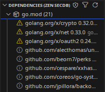
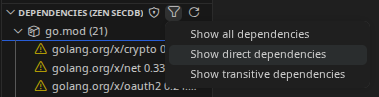
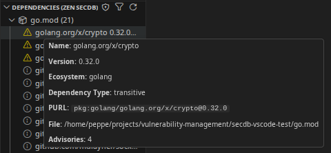
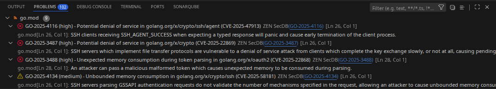
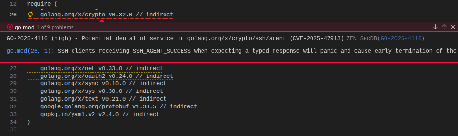
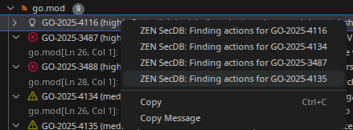
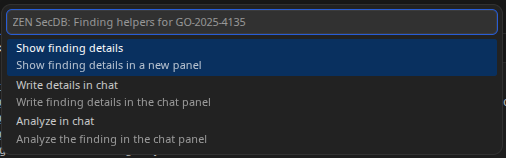
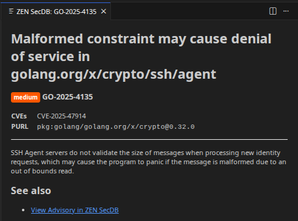
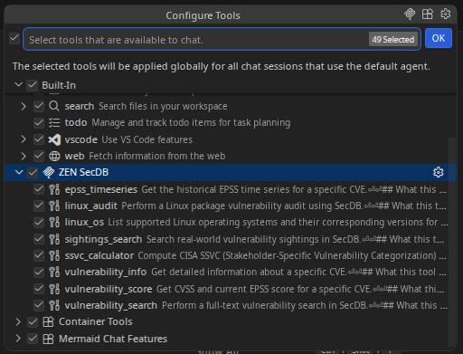
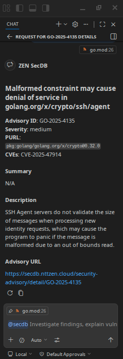

# ZEN SecDB

Dependency discovery, dependency audit, and vulnerability intelligence for Visual Studio Code.

ZEN SecDB helps you detect project dependencies, audit them against [ZEN SecDB Portal](https://secdb.nttzen.cloud), surface advisories directly in VS Code, and investigate findings through built-in chat workflows.

## Features

- Detect dependencies from supported project files
- Generate PURLs (Package URL) for discovered packages
- Audit dependencies against [ZEN SecDB Portal](https://secdb.nttzen.cloud)
- Show findings in the **Problems** panel
- Browse detected dependencies in a dedicated **Tree View**
- Open advisory details directly from VS Code
- Open AI chat workflows for finding analysis
- Configure the **ZEN SecDB MCP server** from VS Code
- Use a **chat participant** for finding info workflows

## Supported ecosystems

Current support includes:

- **npm**
  - `package.json`
  - `package-lock.json`
- **Python**
  - `requirements.txt`
  - `requirements-*.txt`
- **Go**
  - `go.mod`

## What the extension does

ZEN SecDB currently supports two main workflows:

### Dependency scan

This detects project dependencies and populates the dependency view without performing a vulnerability audit.

Use this when you want to verify:

- what the extension detected
- which files were parsed
- which package versions and PURLs were generated

### Dependency audit

This detects dependencies, sends their PURLs to SecDB, and returns matching advisories and CVEs.

Findings are surfaced directly in:

- the **Problems** panel
- contextual actions
- advisory details views

## Commands

### Dependency commands

| Command | Description |
|---|---|
| **SecDB: Scan Dependencies** | Detect dependencies in the current workspace without running an audit. |
| **SecDB: Audit Dependencies** | Detect dependencies and audit them against [ZEN SecDB Portal](https://secdb.nttzen.cloud). |

### MCP commands

| Command | Description |
|---|---|
| **SecDB: MCP Actions** | Open MCP-related actions for the SecDB MCP server. |

### AI and chat workflows

The extension currently supports chat-based workflows such as:

| Workflow | Description |
|---|---|
| **Info** | Retrieve structured information for a finding through the chat participant. |
| **Analyze** | Open the VS Code chat with a prefilled prompt for finding analysis. |

## Views

### SecDB Dependencies

The dependency view shows detected packages grouped by source file.

Each dependency can include:

- ecosystem
- name
- version
- PURL (Package URL)
- advisory count, when available

This view is useful both for normal usage and for troubleshooting dependency detection.

## Quick start

1. Open a workspace containing supported dependency files
2. Run `SecDB: Scan Dependencies` (detection only) or `SecDB: Audit Dependencies` command (or use the buttons in **Dependencies (ZEN SecDB)** panel):
3. Review:

- the **Dependencies (ZEN SecDB)** view

  

  

  

- the **Problems** panel

  

- the problem entry

  

- finding details actions

  

  

  


## MCP integration

ZEN SecDB automatically configure the [ZEN SecDB MCP server](https://secdb.nttzen.cloud/mcp) inside VS Code.

  

This is useful as a foundation for future MCP-driven workflows and server-side prompt integrations.

At the moment, the extension focuses on:

- MCP server configuration
- MCP-related actions from VS Code

For more information, please refer to the [MCP Server](https://secdb.nttzen.cloud/docs/integrations/mcp) documentation on the [ZEN SecDB Portal](https://secdb.nttzen.cloud).

## Chat integration

ZEN SecDB currently supports two chat-oriented workflows:

### Analyze

The extension can open the VS Code chat with a prefilled prompt based on the selected finding, so you can analyze it with the currently selected model using the tools exposed by ZEN SecDB MCP Server.

### Chat participant

A chat participant (`@secdb`) is available for info workflows, allowing structured retrieval of finding details from inside chat.



## Troubleshooting

**No dependencies detected**

Check that:
- the workspace contains supported dependency files
- the files are not excluded by your workspace layout
- versions can be resolved from the detected files

**No findings are shown after audit**

Check that:
- the ZEN SecDB API service is reachable
- the detected dependencies produced valid PURLs
- the ZEN SecDB instance contains matching advisory data

**MCP server is visible but not behaving as expected**

Check that:
- the ZEN SecDB MCP server is correctly registered in VS Code
- the server can start successfully
- the expected tools are exposed by the server

## Privacy and security

This extension may send dependency metadata such as package names, versions, and PURLs to ZEN SecDB Portal.

Before using the extension in sensitive environments, review:
- what dependency metadata is sent
- how your MCP and chat workflows are configured
- whether your environment requires stricter controls for external services

## Roadmap

Planned or possible future improvements include:
- support for additional ecosystems
- richer advisory details views
- deeper MCP-assisted investigation workflows
- MCP server-side prompt workflows
- expanded chat participant capabilities

## Development

**Run locally**

1. Clone the repository
2. Install dependencies
3. Open the project in VS Code
4. Press `F5` to launch an Extension Development Host

**Build**

```bash
npm install
npm run compile
```

**Watch mode**

```bash
npm run watch
```

## See also

- ZEN SecDB Portal: https://secdb.nttzen.cloud
- ZEN SecDB MCP Server:
  - Server URL: https://secdb.nttzen.cloud/mcp
  - Documentation: https://secdb.nttzen.cloud/docs/integrations/mcp

## License
MIT, See [LICENSE](LICENSE.txt) for more information.